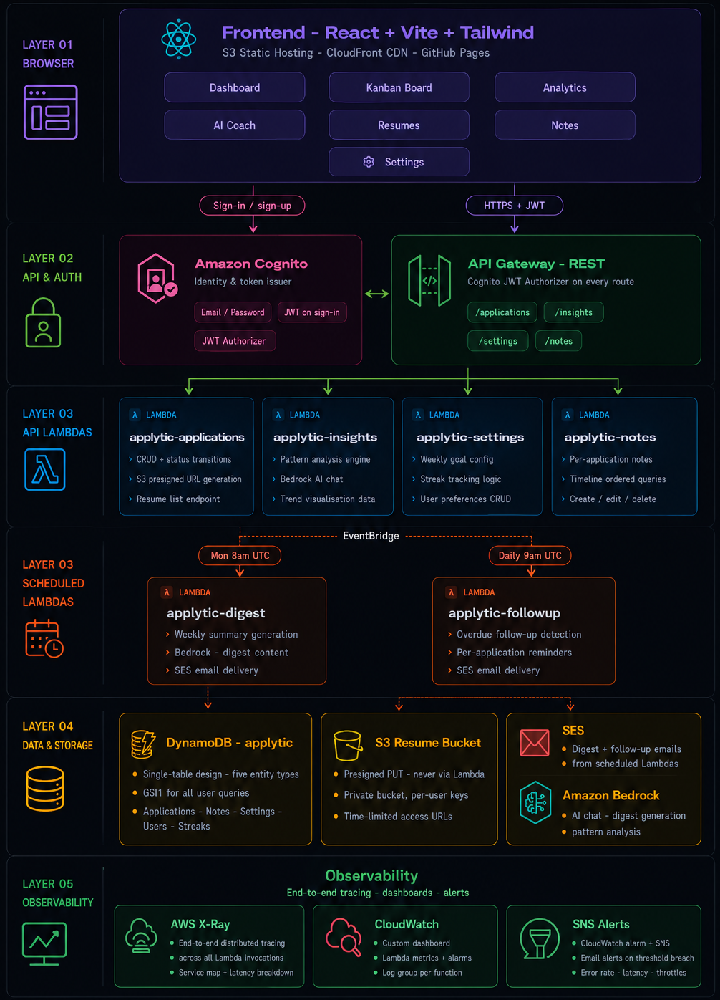

# SmartCV


> AI-powered job application tracker that learns from your rejections.


### 🚀 [Start Using SmartCV](https://huynhnhan68.com/SmartCV/)
*Live in production. Free to use.*


<p align="center">
  
</p>

SmartCV tracks every job application you submit, detects patterns across rejections (which resume version converts best, which source channel works, which company sizes respond), and uses Amazon Bedrock to turn that data into actionable coaching - delivered as a chat interface and a weekly email digest.

Built end-to-end on AWS as a production-grade application. Every service is serverless, infrastructure is code, and every push auto-deploys via GitHub Actions.

---

## Why I Built This

I was job hunting and had no data on why I was getting rejected. I had a spreadsheet with company names and "rejected" written next to most of them - but no signal on *why*. Was it my resume? The channel? The company size?

So I instrumented my own job search. Every application became a data point. After a few weeks I had enough data to see that my `v1-generic` resume had a 0% response rate from enterprise companies, while `v3-ml-focused` was getting interviews from startups via referrals. That's the kind of insight you can act on.

---

## Features

**Application tracking**
- Log applications with company, role, source channel, resume version, company size, job description URL, follow-up date
- Kanban board with drag-and-drop status updates (Applied - Screened - Interview - Offer / Rejected)
- Click any card to view full detail, edit all fields, change status, see timeline
- Search by company/role, filter by source channel
- Color-coded left border per status on kanban cards for instant visual scanning
- Amber "Follow up" badge on overdue cards

**Weekly goal tracking**
- Set a weekly application target on the Dashboard
- Progress bar showing current week vs goal, turns green when met
- Streak counter - consecutive weeks hitting your goal (fire icon)
- Inline goal editing - click the pencil to update your target anytime

**Follow-up reminders**
- Attach a follow-up date to any application
- Daily email when applications are overdue for follow-up, grouped by user
- Never miss a follow-up again

**Notes timeline**
- Add timestamped notes to any application
- Full per-application audit trail
- Notes sorted oldest first for easy reading

**CSV export and import**
- Export all applications to a CSV with one click - no Lambda, pure client-side
- Import from CSV with full validation, preview, and error reporting
- Download import template to get started quickly

**AI insight engine**
- Pattern analysis across 6 dimensions: source channel, company size, resume version, role seniority, weekly velocity, status funnel
- Response rate computed per bucket - shows exactly which resume version or source is working
- AI coaching chat powered by Bedrock - answers questions like "why am I getting ghosted?" using your actual data as context
- Markdown rendering in chat responses
- Weekly email digest every Monday with stats + one AI-generated personalised tip

**Resume version tracker**
- Upload multiple PDF versions to S3 via presigned URLs
- Tag each application with which version was used
- Analytics shows conversion rate per version side-by-side

**UI / UX**
- Full dark mode with system preference detection, persisted to localStorage
- Mobile responsive - hamburger sidebar on small screens
- Loading skeletons on every page instead of blank states
- Meaningful empty states with calls to action
- Toast notifications (top-center)

---

## Architecture

<p align="center">
  
</p>

<!---SmartCV — SYSTEM ARCHITECTURE

━━━━━━━━━━━━━━━━━━━━━━━━━━━━━━━━━━━━━━━━━
 LAYER 01 — BROWSER / FRONTEND
━━━━━━━━━━━━━━━━━━━━━━━━━━━━━━━━━━━━━━━━━
Stack      :  React + Vite + Tailwind CSS
Hosting    :  S3 Static Hosting  +  CloudFront CDN  +  GitHub Pages
Pages      :  Dashboard · Kanban Board · Analytics · AI Coach · Resumes · Notes · Settings


━━━━━━━━━━━━━━━━━━━━━━━━━━━━━━━━━━━━━━━━━
 AUTH
━━━━━━━━━━━━━━━━━━━━━━━━━━━━━━━━━━━━━━━━━
Service    :  Amazon Cognito
Method     :  Email + Password
Tokens     :  JWT (Access + ID) issued on sign-in
Integration:  JWT Authorizer attached to every API Gateway route


━━━━━━━━━━━━━━━━━━━━━━━━━━━━━━━━━━━━━━━━━
 LAYER 02 — API LAYER
━━━━━━━━━━━━━━━━━━━━━━━━━━━━━━━━━━━━━━━━━
Service    :  API Gateway (REST)
Authorizer :  Cognito JWT (applied to all routes)

Routes
  /applications    →  SmartCV-applications Lambda
  /insights        →  SmartCV-insights Lambda
  /settings        →  SmartCV-settings Lambda
  /notes           →  SmartCV-notes Lambda


━━━━━━━━━━━━━━━━━━━━━━━━━━━━━━━━━━━━━━━━━
 LAYER 03 — COMPUTE / API-DRIVEN LAMBDAS
━━━━━━━━━━━━━━━━━━━━━━━━━━━━━━━━━━━━━━━━━

┌─────────────────────────────┐  ┌─────────────────────────────┐
│  SmartCV-applications      │  │      SmartCV-insights      │
│   ────────────────────────  │  │   ───────────────────────── │
│  • CRUD + status transitions│  │   • Pattern analysis engine │
│  • S3 presigned URL gen     │  │   • Bedrock AI chat         │
│  • Resume list endpoint     │  │   • Trend visualisation data│
└─────────────────────────────┘  └─────────────────────────────┘

┌─────────────────────────────┐  ┌─────────────────────────────┐
│     SmartCV-settings       │  │        SmartCV-notes       │
│  ─────────────────────────  │  │  ─────────────────────────  │
│  • Weekly goal config       │  │  • Per-application notes    │
│  • Streak tracking logic    │  │  • Timeline ordered queries │
│  • User preferences CRUD    │  │  • Create / edit / delete   │
└─────────────────────────────┘  └─────────────────────────────┘


━━━━━━━━━━━━━━━━━━━━━━━━━━━━━━━━━━━━━━━━━
 LAYER 03 — COMPUTE / SCHEDULED LAMBDAS
━━━━━━━━━━━━━━━━━━━━━━━━━━━━━━━━━━━━━━━━━
Trigger    :  Amazon EventBridge (cron schedules)

┌─────────────────────────────┐  ┌──────────────────────────────┐
│       SmartCV-digest       │  │          SmartCV-followup   │
│  Trigger: Mon 8am UTC       │  │  Trigger: Daily 9am UTC      │
│  ─────────────────────────  │  │  ─────────────────────────   │
│  • Weekly summary via       │  │  • Overdue follow-up detect  │
│    Bedrock                  │  │  • Per-application reminders │
│  • SES email delivery       │  │  • SES email delivery        │
└─────────────────────────────┘  └──────────────────────────────┘


━━━━━━━━━━━━━━━━━━━━━━━━━━━━━━━━━━━━━━━━━
 LAYER 04 — DATA & STORAGE
━━━━━━━━━━━━━━━━━━━━━━━━━━━━━━━━━━━━━━━━━

DynamoDB (table: SmartCV)
  Design    :  Single-table
  Entities  :  Applications · Notes · Settings · Users · Streaks
  Index     :  GSI1 — userId partition key for all user queries

S3 Resume Bucket
  Access    :  Presigned PUT — browser uploads directly, never via Lambda
  Security  :  Private bucket, per-user key prefix
  URLs      :  Time-limited presigned URLs for reads

Amazon SES
  Usage     :  Email delivery for Digest + Follow-up Lambdas

Amazon Bedrock
  Usage     :  AI chat (insights), weekly digest generation, pattern analysis


━━━━━━━━━━━━━━━━━━━━━━━━━━━━━━━━━━━━━━━━━
 LAYER 05 — OBSERVABILITY
━━━━━━━━━━━━━━━━━━━━━━━━━━━━━━━━━━━━━━━━━

AWS X-Ray
  • End-to-end distributed tracing
  • Covers: API Gateway → Lambda → DynamoDB
  • Service map + latency breakdown per segment

CloudWatch
  • Custom dashboard (all Lambda metrics)
  • Log groups per function
  • Metric alarms: error rate · latency · throttles

SNS Email Alerts
  • CloudWatch alarm → SNS topic → email
  • Alerts on: error spikes, high latency, throttling


━━━━━━━━━━━━━━━━━━━━━━━━━━━━━━━━━━━━━━━━━
 LAYER 06 — CI/CD
━━━━━━━━━━━━━━━━━━━━━━━━━━━━━━━━━━━━━━━━━
Platform   :  GitHub Actions
Auth       :  OIDC — no static AWS access keys stored

Pipeline steps:
  1. Push to main branch
  2. Run tests (unit + integration)
  3. CDK deploy — backend infrastructure + Lambda code
  4. S3 sync — frontend bundle + CloudFront invalidation
  5. GitHub Pages deploy — parallel static hosting

━━━━━━━━━━━━━━━━━━━━━━━━━━━━━━━━━━━━━━━━━
 DATA FLOW SUMMARY
━━━━━━━━━━━━━━━━━━━━━━━━━━━━━━━━━━━━━━━━━

  Browser
    │
    ├─── sign-in ──────────────────→ Cognito → JWT
    │
    └─── HTTPS + JWT ──────────────→ API Gateway (REST)
                                                │
                    ┌─────────────────────┼────────────────────┐
                    │                           │                         │
              /applications                 /insights             /settings · /notes
                    │                           │                         │
           SmartCV-applications           SmartCV-insights      SmartCV-settings
           SmartCV-notes                       │                         │
                    │                      Bedrock (AI)                   │
                    └─────────────────────┴────────────────────┘
                                          │
                                    DynamoDB (SmartCV)
                                    S3 (resumes — direct presigned)
                                    SES (email)

  EventBridge (cron)
    ├── Mon 8am  → SmartCV-digest   → Bedrock → SES
    └── Daily 9am → SmartCV-followup → SES

  All Lambda invocations
    └── X-Ray tracing → CloudWatch → SNS alerts --->


---

## Key Engineering Decisions

**Single-table DynamoDB** - two entity types (APPLICATION, STATUS_EVENT) in one table with composite keys. Every query is O(1). No joins. Scales to millions of requests/sec with no configuration changes.

**Pattern analysis before LLM** - the insights Lambda computes structured metrics (response rates per bucket) before calling Bedrock. The LLM receives hard numbers as context, not raw records. This makes advice data-driven and specific rather than generic.

**Serverless-first** - no EC2, no containers, no idle servers. Lambda + API Gateway + DynamoDB means ~$0 at low volume and automatic scaling. EventBridge replaces cron servers entirely.

**ARM64 Lambda** - all functions run on Graviton2 (ARM64) for ~20% cost reduction and faster cold starts vs x86.

**Presigned S3 URLs for resume upload** - the Lambda generates a presigned URL and returns it to the client. The file then uploads directly from the browser to S3 - never passes through Lambda.

**Lambda Layer for shared code** - single source of truth for CORS, auth extraction, error formatting, Pydantic validation, and X-Ray tracing. All seven Lambda handlers share it.

**Client-side CSV** - export and import are handled entirely in the browser. No Lambda invocation needed for either operation, keeping them fast and free.

**Streak computation** - looks back 8 weeks maximum, current week excluded (may be incomplete). Walks back week by week, breaks on first miss.

---

## Tech Stack

| Layer | Service |
|---|---|
| Frontend | React 18, TypeScript, Vite, Tailwind CSS, react-markdown |
| Auth | Amazon Cognito (email + JWT) |
| API | API Gateway REST + Lambda (Python 3.12, ARM64) |
| AI / ML | Amazon Bedrock - Amazon Nova Lite |
| Database | DynamoDB - single-table design, PAY_PER_REQUEST |
| Storage | S3 - resume versioning + frontend hosting |
| CDN | CloudFront (450+ edge locations) |
| Scheduling | EventBridge cron (Monday 8am UTC digest, daily 9am UTC follow-ups) |
| Email | Amazon SES |
| IaC | AWS CDK v2 TypeScript |
| CI/CD | GitHub Actions |

---

## Project Structure

```
SmartCV/
├── cdk/                    # AWS CDK v2 stack - all infrastructure as code
│   ├── bin/app.ts
│   └── lib/SmartCV-stack.ts
├── lambdas/                # Python 3.12 Lambda handlers
│   ├── applications/       # CRUD + presigned S3 URL generation
│   ├── insights/           # Pattern analysis + Bedrock AI coaching
│   ├── digest/             # Weekly SES email digest
│   ├── followup/           # Daily follow-up reminder emails
│   ├── settings/           # Weekly goal + streak tracking
│   ├── notes/              # Per-application notes timeline
│   ├── cognito_verify/     # Post Confirmation trigger - SES email verification
│   └── shared_layer/       # Lambda Layer - shared middleware, Pydantic, X-Ray
├── frontend/               # React + Vite + Tailwind CSS
│   └── src/
│       ├── components/     # Kanban, Analytics, Chat, Sidebar, Resume, CSV
│       ├── hooks/          # useApplications, useSettings, useNotes
│       ├── lib/            # API client, Amplify config, theme, csv utils
│       ├── pages/          # Dashboard
│       └── types/          # Shared TypeScript types
├── tests/                  # 207 pytest tests (90.75% coverage)
│   ├── test_applications.py
│   ├── test_applications_integration.py
│   ├── test_insights.py
│   ├── test_insights_integration.py
│   ├── test_digest.py
│   ├── test_cognito_verify.py
│   ├── test_followup.py
│   ├── test_settings.py
│   └── test_notes.py
├── scripts/
│   ├── seed_data.py
│   ├── build_layer.sh
│   └── setup_oidc_v11.sh
└── .github/workflows/
    ├── deploy.yml
    └── codeql.yml
```

---

## DynamoDB Single-Table Design

Table name: `SmartCV`

| Entity | PK | SK | GSI1PK | GSI1SK |
|---|---|---|---|---|
| Application | `USER#userId` | `APP#appId` | `USER#userId` | `DATE#timestamp` |
| Status event | `APP#appId` | `EVENT#timestamp` | - | - |
| Rate limit | `RATELIMIT#userId` | `DATE#YYYY-MM-DD` | - | - |
| User settings | `USER#userId` | `SETTINGS` | - | - |
| Note | `APP#appId` | `NOTE#timestamp#noteId` | - | - |

**Access patterns:**
- List all applications for user - GSI1 query on `USER#userId` sorted by date
- Get single application - Main table get on `USER#userId` + `APP#appId`
- Get status history for an app - Query `APP#appId` with `EVENT#` prefix
- Get notes for an app - Query `APP#appId` with `NOTE#` prefix
- Get user settings - Get on `USER#userId` + `SETTINGS`

---

## API Routes

```
GET    /v1/applications
POST   /v1/applications
GET    /v1/applications/{appId}
PUT    /v1/applications/{appId}
DELETE /v1/applications/{appId}
POST   /v1/applications/{appId}/status
GET    /v1/applications/{appId}/notes
POST   /v1/applications/{appId}/notes
DELETE /v1/applications/{appId}/notes/{noteId}
POST   /v1/resumes/upload-url
GET    /v1/resumes/list
GET    /v1/insights
POST   /v1/insights/chat
GET    /v1/users/settings
PUT    /v1/users/settings
```

All routes protected by Cognito JWT authorizer.

---

## Scale and Cost

| Metric | Value |
|---|---|
| API throughput | 10,000 req/sec (API Gateway default) |
| DynamoDB SLA | 99.999% availability |
| Lambda cold start | ~300-400ms (Python 3.12 ARM64) |
| CloudFront edge locations | 450+ worldwide |
| Cost at 0 users | ~$0/month |
| Cost at 100 users | ~$2-5/month |
| Cost at 1,000 users | ~$15-30/month |
| Backend test suite | 207 tests, 90.75% coverage |
| Frontend test suite | 14 Vitest tests |
| Full CDK deploy from scratch | under 3 minutes |

---

## CI/CD Pipeline

```
push to main
    ├── test (pytest 207 tests, 70% coverage threshold)
    ├── test-frontend (vitest 14 tests)
    └── (both must pass before)
            ├── deploy-backend (cdk deploy)
            ├── deploy-frontend-aws (s3 sync + cloudfront invalidation)
            └── deploy-frontend-pages (GitHub Pages)
```

---

## Local Setup

### Prerequisites
- Node.js 18+
- Python 3.12
- AWS CLI configured (`aws configure`)
- AWS CDK CLI: `npm install -g aws-cdk`

### Deploy backend
```bash
bash scripts/build_layer.sh
cd cdk && npm install && cdk deploy
```

### Run frontend locally
```bash
cd frontend && npm install && npm run dev
```

### Run tests
```bash
pip install pytest boto3 pydantic aws-lambda-powertools pytest-cov
pip install "moto[dynamodb,s3,ses,cognitoidp]"
python -m pytest tests/ -v --tb=short --cov=lambdas --cov-fail-under=70
```

### Run frontend tests
```bash
cd frontend && npm run test
```

### Seed demo data
```bash
cd scripts && python seed_data.py --user-id YOUR_COGNITO_SUB
```

---

## Issues Encountered and Fixed

### 1. TypeScript error on CDK deploy (`Partial<FunctionProps>` type)

* **Issue:** `runtime` became optional when using `Partial<FunctionProps>`, causing TypeScript to reject undefined values.
* **Fix:** Added `runtime` explicitly to each Lambda and removed the shared defaults spread.

### 2. esbuild crash on Windows

* **Issue:** esbuild failed due to corrupted dependencies or a Node.js version mismatch.
* **Fix:** Deleted `node_modules` and `package-lock.json`, reinstalled dependencies, and used Node 18/20 LTS.

### 3. pytest module name collision

* **Issue:** Multiple Lambda handlers were named `handler.py`, causing import collisions during tests.
* **Fix:** Used `importlib.util.spec_from_file_location()` with unique module names.

### 4. Timezone-aware datetime bug in velocity calculation

* **Issue:** `dateApplied` was stored as a `YYYY-MM-DD` string and could not be subtracted from a timezone-aware datetime.
* **Fix:** Detected 10-character date strings and added UTC timezone information before subtraction.

### 5. Chat history lost on navigation

* **Issue:** Component-level `useState` was reset whenever the component unmounted.
* **Fix:** Lifted message state to `App.tsx` and passed it down as props.

### 6. GitHub Actions npm cache error

* **Issue:** `cache: 'npm'` requires a `package-lock.json` file.
* **Fix:** Removed the cache configuration and used `npm install`.

### 7. `import.meta.env` TypeScript error in CI

* **Issue:** Vite client types were not available during CI builds.
* **Fix:** Added `"types": ["vite/client"]` to `tsconfig.json`.

### 8. Bedrock model EOL

* **Issue:** The selected Bedrock model reached AWS end-of-life during development.
* **Fix:** Updated `BEDROCK_MODEL_ID` and used `aws logs tail` for debugging.

### 9. Bedrock inference profile requirement

* **Issue:** Claude 3.7+ models require cross-region inference profiles using a `us.` prefix.
* **Fix:** Updated model configuration to use the correct inference profile identifier.

### 10. IAM wildcard required for inference profiles

* **Issue:** Foundation model ARNs did not cover inference profile ARNs.
* **Fix:** Used `Resource: "*"` for Bedrock IAM permissions.

### 11. AWS Marketplace subscription required

* **Issue:** Claude 3.7 and Haiku 4.5 required an AWS Marketplace subscription.
* **Fix:** Switched to Amazon Nova Lite.

### 12. Amazon Nova request/response format differences

* **Issue:** Nova models do not accept `anthropic_version` in the request payload.
* **Fix:** Detected the model family from `MODEL_ID` and generated the appropriate payload format.

### 13. Pie chart labels clipped

* **Issue:** External labels overflowed the chart container.
* **Fix:** Implemented a custom label renderer that draws percentage values inside slices at the midpoint radius.

### 14. Digest Lambda missing Cognito permission

* **Issue:** `cognito-idp:AdminGetUser` permission was missing from the IAM policy.
* **Fix:** Added an IAM policy statement targeting the Cognito User Pool ARN.

### 15. SES sandbox – recipient emails not verified

* **Issue:** New AWS accounts in the SES sandbox can only send emails to verified recipient addresses.
* **Fix:** Added a Cognito Post Confirmation trigger that automatically verifies newly registered user emails.

### 16. GitHub Pages blank page after login

* **Issue:** `BrowserRouter` defaulted to `/` while the application was hosted under `/SmartCV/`.
* **Fix:** Passed `import.meta.env.BASE_URL` as the `basename` to `BrowserRouter`.

### 17. Windows pip `--user` + `-t` conflict in `build_layer.sh`

* **Issue:** Windows automatically added `--user`, which conflicts with pip's `-t` option.
* **Fix:** Added the `--no-user` flag to the pip install command.

### 18. CDK construct ID mismatch on redeploy

* **Issue:** CloudFormation rejected deployment with a "Resource already exists" error.
* **Fix:** Preserved the original construct IDs when updating existing alarms.

### 19. Lambda ARM64 vs x86_64 architecture mismatch

* **Issue:** `build_layer.sh` produced x86_64 wheels while Lambdas ran on ARM64, causing `pydantic_core` runtime failures.
* **Fix:** Added `--platform manylinux2014_aarch64 --only-binary=:all:` to the pip install command.

### 20. `parse_body` stub missing error handling in `test_insights.py`

* **Issue:** The test stub crashed on invalid JSON input.
* **Fix:** Replaced the lambda with a proper function that wraps `json.loads()` in a try/except block and returns HTTP 400 on failure. The stub is registered in `sys.modules` and reused by subsequent test files.

### 21. `AddApplicationModal` missing `followUpDate` field

* **Issue:** TypeScript builds failed after v2.0 introduced `followUpDate` to the `Application` type.
* **Fix:** Added `followUpDate: null as string | null` to the `defaultForm` object.

### 22. moto installation failure in CI

* **Issue:** The shell interpreted brackets in `moto[dynamodb,...]` as glob expansion.
* **Fix:** Wrapped the package name in quotes during installation.

### 23. Vitest globals breaking `tsc` builds

* **Issue:** `vi`, `beforeAll`, and `afterAll` were not available during standard TypeScript compilation.
* **Fix:** Added `"exclude": ["src/test"]` to `frontend/tsconfig.json`.

---

## Changelog

See [CHANGELOG.md](CHANGELOG.md) for full version history.

---

## Contributing

See [CONTRIBUTING.md](CONTRIBUTING.md) for setup instructions, branching conventions, and the PR process.

---

## Author

**SmartCV Team** - [Github](https://github.com/huynhnhan68)

